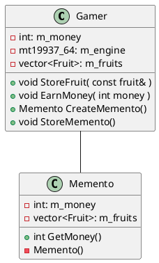
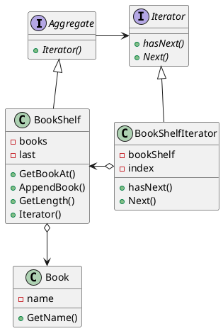

# Design Pattern

## Memento Pattern

保存されるクラスがある瞬間でのMementoを作成する。CreateMementoメソッド
作成したMementoはプログラムのどこかで保存しておく。
状態を戻す必要があったら、RestoreMementoを使って状態を読み込む

## Iterator Pattern

何かがたくさん集まっている時、それらを順番に指し示していき全体を走査する方法

下のクラス図は本棚全体を走査するItrator Patternの例

Iterator Patternは意外と難しかった
BookShelfがIteratorを生成するという発想が思いつかなかった
