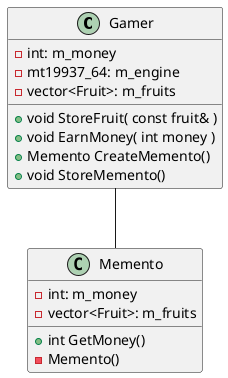

# Design Pattern

## Memento Pattern

```plantuml
@startuml
class Gamer {
  -int: m_money
  -mt19937_64: m_engine
  -vector<Fruit>: m_fruits
  +void StoreFruit( const fruit& )
  +void EarnMoney( int money )
  +Memento CreateMemento()
  +void StoreMemento()
}
class Memento {
  -int: m_money
  -vector<Fruit>: m_fruits
  +int GetMoney()
  -Memento()
}

Gamer -- Memento

@enduml
```

保存されるクラスがある瞬間でのMementoを作成する。CreateMementoメソッド
作成したMementoはプログラムのどこかで保存しておく。
状態を戻す必要があったら、RestoreMementoを使って状態を読み込む