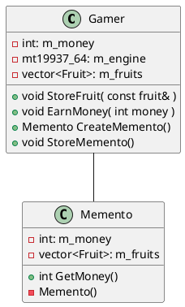
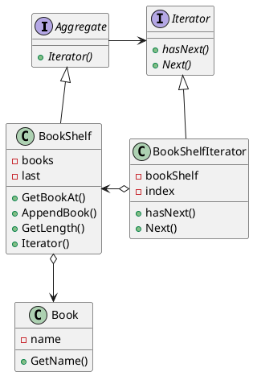
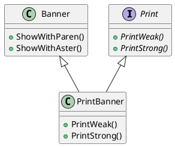
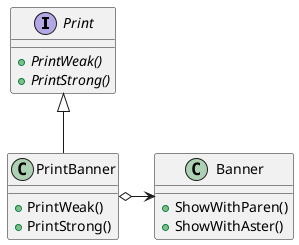
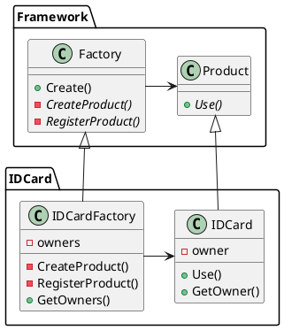
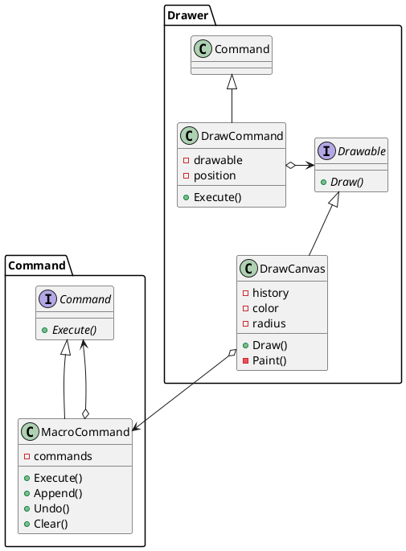
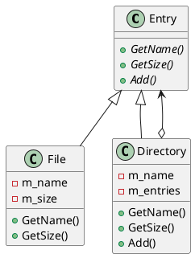
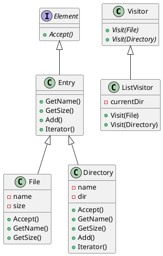

# Design Pattern

本書全体の考え方
「具体的なクラスだけでプログラミングするのではなく、**抽象クラスやインターフェイスを使ってプログラミングする**」
## Memento Pattern



保存されるクラスがある瞬間でのMementoを作成する。CreateMementoメソッド
作成したMementoはプログラムのどこかで保存しておく。
状態を戻す必要があったら、RestoreMementoを使って状態を読み込む

## Iterator Pattern

何かがたくさん集まっている時、それらを順番に指し示していき全体を走査する方法

下のクラス図は本棚全体を走査するItrator Patternの例



Iterator Patternは意外と難しかった
BookShelfがIteratorを生成するという発想が思いつかなかった

Iteratorパターンを使う理由
Iteratorを使うことで実装と数え上げを切り離すことができる。

```

while ( it.HasNext() ) {
  Book book = (Book)it.Next() ;
  system.out.println(book.GetName() ) ;
}
```

上のコードでは、HasNextとNextというIteratorのインターフェイスだけを使っている。
BookShelfの実装で使われているメソッドを使っていない。
つまりBookShelfの実装に依存していないコードになっている。

「数え上げの仕組みがAggregte役の外に置かれている」というのはIterator Patternの特徴。
この特徴によって1つのConcreteAggregate役に対して複数のConcreteIterator役を作ることができる。

## Adapter Pattern

すでに提供されているものと必要なものの間のズレを埋めるようなデザインパターンがAdapter Pattern
Adapter Patternには2種類ある

- クラスによるAdapter Pattern（継承をつかったもの）
- インスタンスによるAdapter Pattern（移譲を使った物）





### どんな時に使うか

既存のクラスを再利用する。この時、既存クラスはAdaptee役になる。新しいクラスはAdapter役になる。
ソフトウェアのバージョンアップの時。古いバージョンとの互換性を保つ必要がある。この時、新しいバージョンをAdaptee役として、古いバージョンをAdapter役とします。

## Factory Method



## Command Pattern

オブジェクト指向プログラミングでは、クラスが仕事を行う。
クラスが仕事を行うときは、自分のクラスや他のクラスのメソッドを呼び出す。
その際、メソッドの履歴は通常残らない。
履歴を管理するためには、命令を表すクラスを作成しておくと良いです。命令一つ一つをそのクラスのインスタインスとして表現する。履歴を管理するときは、このインスタンスたちを管理しておけばよい。



## Composite Pattern

容器と中身を同一視して再帰的な構造を作る。
例として、ディレクトリ構造をあげる。ディレクトリの中にはディレクトリかファイルが追加される。このとき、ディレクトリ=容器、ファイル＝中身である。この構造をクラスで表す。
クラス図は以下。



ディレクトリのサイズを表すコードを書いてみる。

## Visitor Pattern

訪問者を表すクラスVisitor。データ構造と処理を分離するためにこのパターンを使う。
仮にデータ構造に処理のメソッドを書いていた場合、新しい処理を追加する時に、データ構造のクラスを修正する必要が出てくる。
Visitorパターンを使うとデータ構造に新たな処理を追加することが簡単にできる。



コード例はディレクトリとファイルの構造に対してVisitorパターンを適用する。
ディレクトリ構造はComposite Patternで実装する。Leafはファイル、Compositeはディレクトリ。